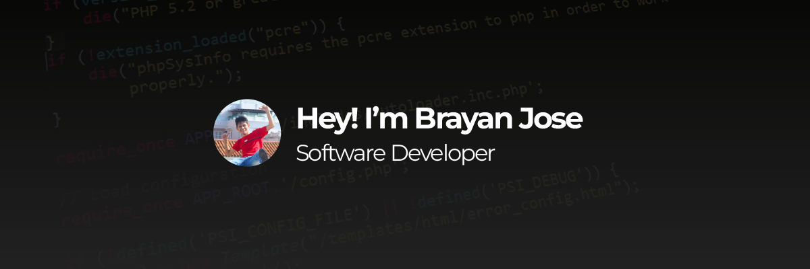

# Hi there 👋
I’m a **Software Development and Analysis (ADSO) student** with hands-on experience in autonomous and client projects. I specialize in web development and audiovisual content creation.

<!-- 

  

    
    
    
  

 -->

## 💻 Languages & Frameworks

  
  
  

<!-- ### More about me:

- 📽 **Programming Streams**: I occasionally stream programming sessions on [Twitch](https://twitch.tv/brayanjse).
- 🚴‍♀️ **MTB Enthusiast**: I enjoy Mountain Biking as a personal hobby.
- 📷 **Photography and Design**: Passionate about capturing moments and visual design.

### Skills

- **Web Development**: Experienced in HTML, CSS, JavaScript, and related technologies.
- **Audiovisual Design**: Skilled in creating high-quality visual content. -->

<!--
## Continuous Learning

Currently improving my **English** skills to enhance my professional growth.

Thanks for checking out my profile! Feel free to reach out if you'd like to connect or collaborate. -->

<!--
**BrayanJse/BrayanJse** is a ✨ _special_ ✨ repository because its `README.md` (this file) appears on your GitHub profile.

Here are some ideas to get you started:

- 🔭 I’m currently working on ...
- 🌱 I’m currently learning ...
- 👯 I’m looking to collaborate on ...
- 🤔 I’m looking for help with ...
- 💬 Ask me about ...
- 📫 How to reach me: ...
- 😄 Pronouns: ...
- ⚡ Fun fact: ...
-->
